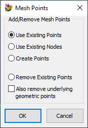

# Femap-Old-Style-Mesh-Points-on-Surface
The Mesh Point Editor in Femap 12 is difficult to use, so don't!

See also: [How to use Femap Scripts](https://github.com/aaronjasso/How_to_use_Femap_Scripts) and [The List of my Femap Scripts](https://github.com/aaronjasso/My-Femap-Scripts)

This macro recreates the familiar and intuative method for creating mesh points on a surface from Femap 11 (and prior versions). The resulting mesh points are fully compatible with the new Mesh Point Editor.
